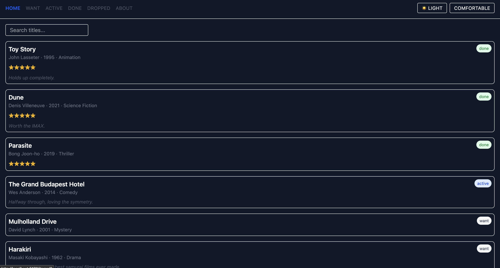
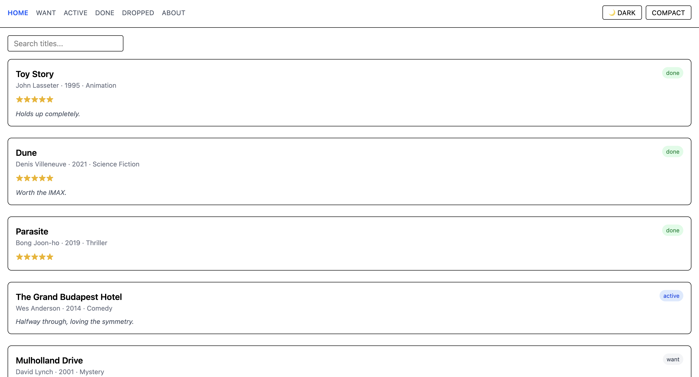
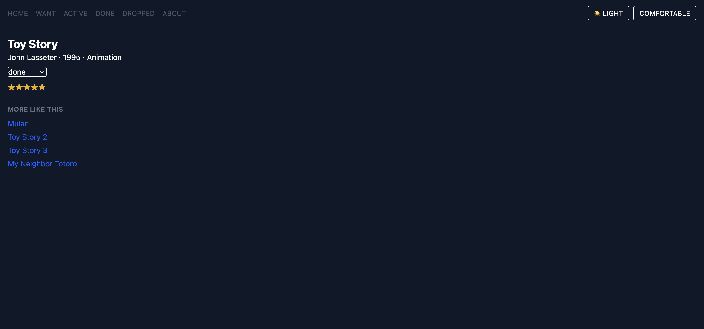

# WatchPile

A personal movie tracker built for CSCI 39548: Practical Web Development. WatchPile lets you browse a catalog of movies, filter by watch status (want / active / done / dropped), search by title, and rate and annotate movies you've finished — all backed by a mock REST API via `json-server`.

## Theme

I built this as a **movie tracker**. Each item in the catalog represents a movie, with fields for director (`creator`), release year, genre, watch status, a 1–5 star rating, and a free-text note.

## Tech Stack

- **React Router** — routing, `useParams`, `useSearchParams` for shareable search URLs
- **TanStack Query** — data fetching, caching, and mutations against the mock API
- **Zustand** — global UI state (theme + density) with `persist` middleware
- **Tailwind CSS** — styling, dark mode, responsive layout
- **json-server** — mock REST backend over `db.json`

## Setup

1. Clone the repo and install dependencies:
   ```bash
   npm install
   ```

2. Start the mock API server (terminal A):
   ```bash
   npm run server
   ```
   This runs `json-server` on `http://localhost:3001`.

3. Start the dev server (terminal B):
   ```bash
   npm run dev
   ```
   This runs Vite on `http://localhost:5173`.

4. Open `http://localhost:5173` in your browser.

To reset the database back to its original seed data at any point (e.g. before taking screenshots):
```bash
npm run reset-db
```

## Features

### Routing
- `/` — full catalog
- `/items/:id` — movie detail page
- `/list/:status` — catalog filtered by status
- `/about` — about page
- `*` — 404 not found page
- Search (`?q=...`) is stored in the URL and survives refresh/paste

### Data & Mutations
- Full catalog and single-item queries via TanStack Query
- Mutations for status change, note update, and rating update, each invalidating the cache so the list refetches automatically
- Loading and error states on every page that fetches data
- "Not found" handling on the detail page for bad IDs

### UI State
- Theme (light/dark) and density (compact/comfortable) toggles in the nav bar
- Both persist across reloads via Zustand's `persist` middleware
- State is read via selectors, not whole-store subscriptions

## Stretch Features Implemented

- **Optimistic updates on status change** (+5) — the status dropdown updates instantly on click, with automatic rollback if the request fails
- **`useShallow` on an object selector** (+3) — used in `NavBar.tsx` to select `{ theme, density }` together; code comment explains the re-render trap this avoids
- **Dependent query: "More Like This"** (+5) — the detail page fetches other movies in the same genre, using `enabled: !!genre` so it waits for the main query to resolve first
- **Per-user view via `?owner=` param** (+2) — e.g. `/?owner=alice` filters the catalog to that owner's items

## Screenshots


